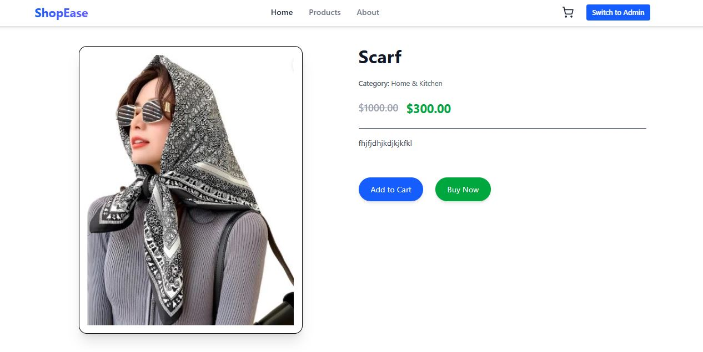
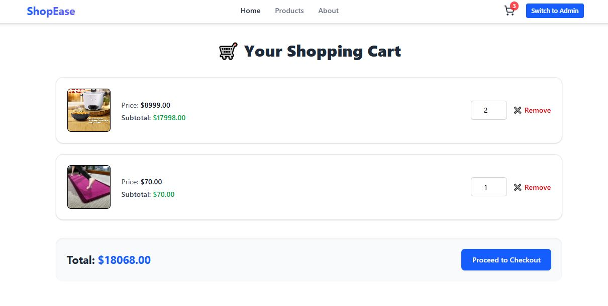
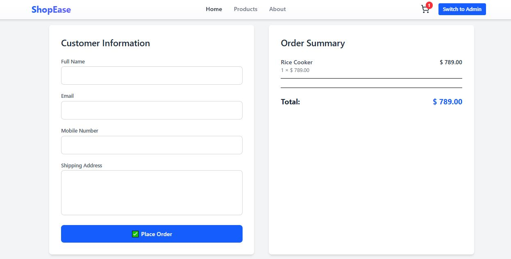

# 🛍️ E-commerce Frontend

This is the frontend application for the E-commerce platform built using **React**, **Redux Toolkit**, **Tailwind CSS**, and **React Router**. It allows users to browse products by category, view detailed product pages, manage their cart, and place orders.

---

## 🔧 Setup Instructions

### 1. Clone the Repository

```bash
git clone https://github.com/imran-8088/ecommerce-frontend.git
cd ecommerce-frontend
```

### 2. Install Dependencies

```bash
npm install
```

### 3. Environment Configuration

Create a `.env` file in the root directory and add the backend API base URL:

```env
VITE_API_BASE_URL=http://localhost:5000/api
```

### 4. Run the App

```bash
npm run dev   # if you're using Vite
# or
npm start     # if you're using Create React App
```

---

## 🧱 Tech Stack

- **React** – Frontend framework
- **Redux Toolkit** – State management
- **Redux Saga** – Side effect middleware
- **Tailwind CSS** – Utility-first CSS framework
- **React Router DOM** – Routing
- **Axios** – API requests
- **React Hot Toast** – Notifications

---


---

## 🎯 Features Implemented

### 🛒 Product Listing (Home Page)
- Products displayed grouped by category
- Each product shows:
  - Image
  - Name
  - Price and discounted price
  - "Add to Cart" button
  - 
  - 

### 🔍 Product Detail Page
- Detailed product view
- Includes “Add to Cart” and “Buy Now” buttons
- 

### 🛍️ Cart Page
- Shows all added items
- Quantity update and remove options
- 


### 📦 Checkout Page
- Basic customer detail form
- On submission, places order and sends cart data to backend
- 

### 🛠️ Admin Panel
- Product list with pagination
- Add/Edit/Delete product modals
- Dynamic category dropdown
- 

---

## 🌐 API Endpoints Consumed

| Method | Endpoint                  | Description                      |
|--------|---------------------------|----------------------------------|
| GET    | `/api/products`           | Fetch all products               |
| GET    | `/api/products/:id`       | Fetch single product             |
| GET    | `/api/categories`         | Fetch product categories         |
| POST   | `/api/orders`             | Submit order with cart details   |
| POST   | `/api/products`           | Add new product (with image)     |
| PUT    | `/api/products/:id`       | Update product & image           |
| DELETE | `/api/products/:id`       | Delete product & image           |

---

## 📦 Backend

Make sure the backend is running at `http://localhost:5000`. See the [backend README](https://github.com/imran-8088/ecommerce-backend/blob/main/README.md) for setup instructions.

---

  ## 👤 Author

- **Shaikh Imran**

